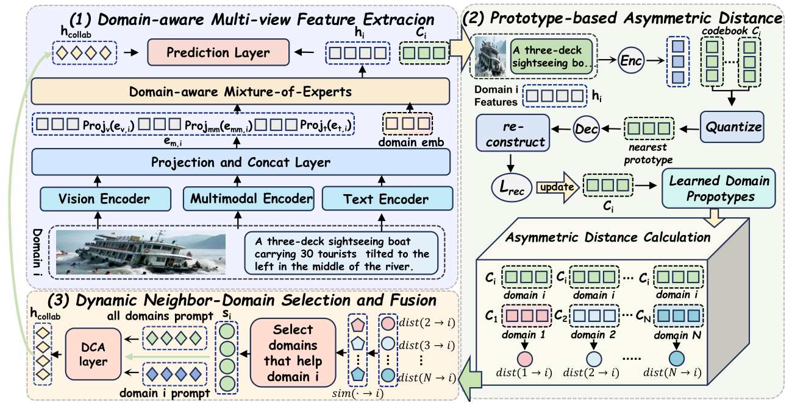

# From Blind Transfer to Wise Selection: Prototype-driven Asymmetric Neighbor-Domain Adaptation For Fake News Detection

This repository contains the implementation of the paper "From Blind Transfer to Wise Selection: Prototype-driven Asymmetric Neighbor-Domain Adaptation For Fake News Detection", publish on AAAI 2026.


## Abstract

Multimodal fake news detection across different domains is hampered by the critical challenge of negative transfer, which arises from the indiscriminate fusion of knowledge from all available source domains. Existing methods attempt to learn domain-invariant features or leverage external knowledge but often aggregate information from all domains equally. However, these approaches largely ignore the asymmetric relationships between domains, leading to performance degradation when irrelevant or conflicting knowledge is introduced. To address this, we propose a novel **PANDA (Prototype-driven Asymmetric Neighbor-Domain Adaptation)** framework that dynamically selects and integrates knowledge from only the most beneficial domains. Initially, PANDA employs a **Domain-aware Modal Prompt Generation (DMPG)** module to learn transferable knowledge representations for each domain. We then introduce a novel **Prototype-based Asymmetric Distance (PAD)** to quantify directional domain transferability, which guides a **Gumbel-based Neighbor Selector (GNS)** to identify the most relevant neighbor domains. Subsequently, a **Domain-Collaborative Attention (DCA)** module adaptively fuses the selected knowledge to enhance the target domain's representation. Extensive experiments on three benchmarks demonstrate PANDA's superiority, outperforming state-of-the-art baselines with an F1-score improvement of 1.5% on the Weibo-21 dataset. The code and theoretical proofs are provided in the supplementary materials.


## Model

Our model architecture is as follows:



The core logic of our model is implemented in `./model/PANDA.py`.

## Environment

This project is developed based on the publicly available framework **MMDFND: Multi-modal Multi-Domain Fake News Detection**. 

To set up the environment, please follow the instructions in the MMDFND repository, which typically involves creating a conda environment and installing the dependencies listed in their `requirements.txt` file.

## Running the Code

The execution process is identical to that of MMDFND. After preparing the datasets and pre-trained weights as required by MMDFND, you can run our model by executing:

```bash
python main.py
```

**Note on Data and Pre-trained Weights:**

Due to the submission policies of AAAI, which impose limitations on the size of supplementary materials, we are unable to provide the datasets and pre-trained weights in this repository at this time. We are committed to releasing a fully reproducible, one-click runnable version of our work, including all necessary data and model weights, upon the acceptance of our paper. We appreciate your understanding. Additionally, the weibo and weibo21 datasets we use, which are identical to those mentioned in MMDFND and DAMMFND in the main text, can be migrated to the corresponding directory of this code for execution.


